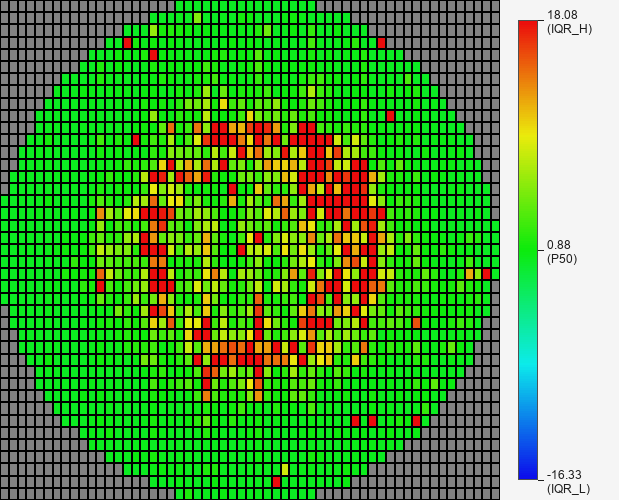
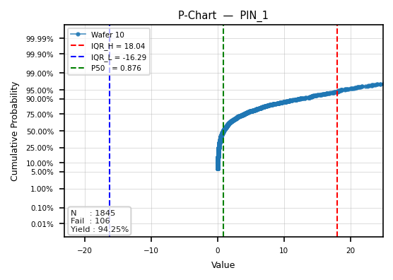

# Wafer Map MCP Server

An **MCP (Model Context Protocol)** server that exposes semiconductor wafer analysis tools to AI assistants.
These tools are designed for semiconductor test data analysis, enabling AI agents to correctly generate key engineering visualization charts such as wafer maps, P-charts, trend plots, and statistical analysis figures from raw test data.


Sample data file header:
BIN, X, Y, WAFER_ID, PIN_1, PIN_2, PIN_3, PIN_4, PIN_5

Definitions:
BIN:
Final test result of each DIE, where 0 indicates Pass.
X:
X-coordinate location of the DIE.
Y:
Y-coordinate location of the DIE.
WAFER_ID:
Unique identifier of the wafer.
PIN_1 ~ PIN_5:
Test results of each corresponding electrical property.

Given a wafer test data file (CSV or ZIP), it renders:
- Yield summary statistics
- Binary pass/fail wafer map
- Continuous-value PIN property heatmaps
- Normal probability plots (P-charts) per wafer

All tools are accessible via a single HTTP endpoint, so any MCP-compatible client can use them.

---

## Preview

| Binary Map | Property Map | P-Chart |
|:---:|:---:|:---:|
|  |  |  |

---

## Tools

| Tool | Description |
|---|---|
| `run_wafer_analysis` | Full analysis in one call: summary + binary map + all PIN maps + P-charts |
| `get_wafer_info` | Basic wafer summary (yield, pass/fail counts, PIN columns) |
| `plot_wafer_bin` | Binary pass/fail wafer map (BIN=0 → teal, else → black) |
| `plot_wafer_property` | Continuous-value heatmap for a single PIN column (blue → red) |
| `plot_pchart` | Normal probability plot per wafer for a PIN column |

### Data Format

CSV or ZIP (containing exactly one CSV) with columns:

```
BIN, X, Y, WAFER_ID, PIN_1, PIN_2, ..., PIN_N
```

- `BIN = 0` → pass, otherwise fail
- `X`, `Y` → die coordinates on the wafer grid
- `PIN_*` → continuous measurement values

### Colour Scale (IQR Robust Sigma)

Property maps and P-chart boundaries use IQR-based bounds to make subtle variations visible:

```
sigma  = (P75 - P25) / 1.35
IQR_L  = P50 - 6 × sigma
IQR_H  = P50 + 6 × sigma
```

---

## Quick Start

### Option A: Docker (recommended)

```bash
docker build -t wafer-mcp .
docker run -p 8001:8001 wafer-mcp
```

The server is now available at `http://localhost:8001/mcp`.

To analyze your own data files, mount a volume:

```bash
docker run -p 8001:8001 -v /absolute/path/to/data:/data wafer-mcp
# then pass file_path="/data/your_wafer.zip" when calling tools
```

### Option B: Local Python

**Requirements:** Python 3.10+

```bash
pip install -r requirements.txt
python server.py
```

---

## Sample Data

A sample dataset is bundled with the project at `sample_data/sample_1.zip`.

| Location | Path |
|---|---|
| Local | `./sample_data/sample_1.zip` |
| Docker | `/app/sample_data/sample_1.zip` |

Quick smoke test (Docker):

```bash
# inside the container the sample lives at /app/sample_data/sample_1.zip
# call any tool with this file_path to verify everything works
```

---

## Claude Desktop Configuration

The server uses Streamable HTTP transport, so use the `url` form in `claude_desktop_config.json`:

```json
{
  "mcpServers": {
    "wafer-map": {
      "url": "http://localhost:8001/mcp"
    }
  }
}
```

**Steps:**
1. Start the MCP server (local or Docker)
2. Add the config above to Claude Desktop
3. Restart Claude Desktop
4. Ask Claude to analyze a wafer data file — it will automatically pick the right tool

---

## Tool Parameters

### `run_wafer_analysis`
| Param | Type | Default | Description |
|---|---|---|---|
| `file_path` | str | required | Path to .csv or .zip file |
| `pin_columns` | list[str] \| None | None | Subset of PIN columns to plot; None = all |
| `target_size` | int | 300 | Output image pixel size |

### `get_wafer_info`
| Param | Type | Default | Description |
|---|---|---|---|
| `file_path` | str | required | Path to .csv or .zip file |

### `plot_wafer_bin`
| Param | Type | Default | Description |
|---|---|---|---|
| `file_path` | str | required | Path to .csv or .zip file |
| `target_size` | int | 300 | Output image pixel size |

### `plot_wafer_property`
| Param | Type | Default | Description |
|---|---|---|---|
| `file_path` | str | required | Path to .csv or .zip file |
| `pin_column` | str | `"PIN_1"` | PIN column to visualise |
| `target_size` | int | 450 | Output image pixel size |
| `data_l` | float \| None | None | Override lower bound of colour scale |
| `data_h` | float \| None | None | Override upper bound of colour scale |

### `plot_pchart`
| Param | Type | Default | Description |
|---|---|---|---|
| `file_path` | str | required | Path to .csv or .zip file |
| `pin_column` | str | `"PIN_1"` | PIN column to plot |
| `target_size` | int | 300 | Output image pixel size |

---

## Project Structure

```
.
├── server.py                    # MCP server entry point
├── requirements.txt             # Python dependencies
├── Dockerfile                   # Container definition
├── sample_data/
│   └── sample_1.zip             # Bundled sample wafer dataset
├── tools/
│   ├── workflow/
│   │   └── analyze_wafer.py     # Orchestrates full analysis
│   ├── information_read/
│   │   └── read_wafer_info.py   # Parse CSV/ZIP and compute yield
│   ├── wafer_map/
│   │   ├── wafer_bin_binary_plot.py    # Binary map renderer (PySide6)
│   │   └── wafer_item_property_plot.py # Property heatmap renderer (PySide6)
│   └── statistic_plot/
│       └── pchart_plot.py       # P-chart renderer (matplotlib)
└── pchart/
    └── PchartReportWidget.py    # Legacy Qt widget (reference only)
```

---

## Tech Stack

- **MCP:** [FastMCP](https://github.com/jlowin/fastmcp) — Streamable HTTP transport
- **Wafer map rendering:** PySide6 offscreen QPainter
- **P-chart rendering:** matplotlib + scipy + statsmodels

---

## License

MIT
